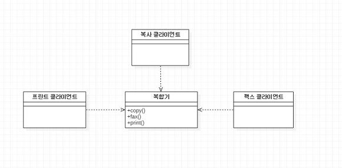
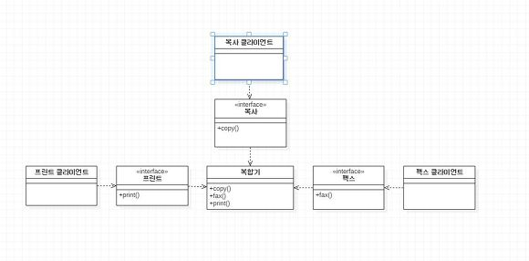
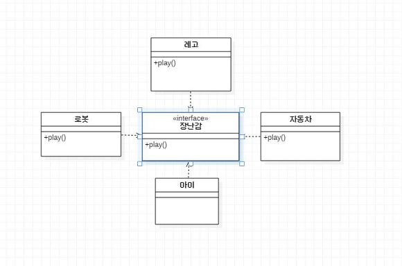

# Back-end

## 프로그래밍 언어
#### Ruby
>명령형 프로그래밍언어이자 함수형 언어  
Python 다음으로 제일 느리다.
* Package Manager
    - RubyGems
    >RubyGems는 Ruby 프로그램 및 라이브러리(Gem)를 배포하기위한 표준 형식, Ruby 설치를 쉽게 관리 할 수있는 도구 및 배포 용 서버를 제공하는 Ruby 프로그래밍 언어의 패키지 관리자입니다.
* Framework
    - Ruby on Rails
    >>Ruby on Rails는 Ruby의 웹 프로그래밍 프레임워크입니다.
    MVC 모델을 기반으로 비즈니스 로직과 UI를 분리하고, 코드의 반복을 줄여주고, 유지보수를 쉽게 해주는 장점이 있다.
#### Node.js
>자바스크립트를 서버에서도 사용을 할 수가 있도록 설계가 되어 있는 서버사이트 스크립트 언어로 서버 개발을 위해서 나온 언어
* Package Manager
    - npm
    >>npm은 Node Packaged Manager의 약자입니다.  Node.js에서 사용 가능한 모듈들을 패키지화 하여 모아두어 라이브러리가 필요할 경우, 웹에서 하나하나 전부 검색할 필요없이 npm으로 내려받으면 된다. Java의 Maven과 비슷하다.
    - yum
    >>npm과 똑같은 기능을 가진다.
* Framework
    - Express
    >>Express는 Node.js를 위한 빠르고 간편한 웹 프레임워크입니다.  
    Node.js의 핵심 모듈인 http와 Connect 컴포넌트를 기반으로 하는 웹 프레임워크다. 그러한 컴포넌트를 미들웨어(middleware)라고 한다. 웹 앱에 MVC 형태의 구조를 제공한다. 이 같은 앱은 백엔드만 갖춘 REST API에서부터 온갖 기능을 제공하는 고도로 확장 가능한 풀스택(jade-browser와 Socket.IO를 포함하는) 실시간 웹 앱에 이르기까지 다양하다.
    - Koa
    >>메모리를 덜먹고 표현력이 좋다. 다른 프레임워크에 비해 미들웨어 작성이 쉽다. 기본적으로 뼈대 프레임워크라서 제공되는 미들웨어와 함께 사용해야만 하는 Express와 Hapi와 달리, 개발자가 필요한 미들웨어만 구성해 사용할 수 있다. ES6를 도입하고 있어 ES6 제너레이터를 사용할 수 있다.
    >>>ES6 제너레이터 )  
    제너레이터 함수는 일반 함수와는 다른 독특한 동작을 한다. 제너레이터 함수는 일반 함수와 같이 함수의 코드 블록을 한 번에 실행하지 않고 함수 코드 블록의 실행을 일시 중지했다가 필요한 시점에 재시작할 수 있는 특수한 함수이다.
    - Hapi
    >>견고함과 재사용성을 요구하는 큰 규모 팀에서는 흔하게 사용한다.
* Testing
    - Jest
    >>Jest는 페이스북에 만든 테스트 프레임워크이다. 빠르게 설치하고, 빠르게 테스트하기 좋다.
#### Python
>파이썬은 사람이 생각하는 방식을 그대로 표현할 수 있는 언어이다.  
```Python
if 4 in [1,2,3,4]: print("4가 있습니다")
```
>위 예제는 다음처럼 읽을 수 있다.  
만약 4가 1, 2, 3, 4 중에 있으면 "4가 있습니다"를 출력한다.
* Package Manager
    - Pip
    >>
* Framework
* Testing
#### PHP7
>별도의 실행 파일 만들 필요 없이 HTML 문서 안에 포함시켜 다양한 언어(C,JAVA,펄언어?)를 문장 형식으로 사용하여 동적으로 사용 할 수 있는 웹 문서라고 볼 수 있다.  
특히 ASP(Active Server Pages) 와 문법이 비슷하여 ASP(Active Server Pages) 배웠 던 사람들은 금방 익힐 수 있다.
* Package Manager
* Framework
* Testing
#### C#
>닷넷 프로그램이 동작하는 닷넷 플랫폼을 가장 직접 반영하고, 또한 닷넷 플랫폼에 강하게 의존하는 프로그래밍 언어입니다. C#은 그 문법적인 특성이 자바와 상당히 유사하며 C#을 통해 다룰 수 있는 닷넷 플랫폼의 기술들조차도 자바를 염두에 둔 것이 많아서 자바와 가장 많이 비교되고 있습니다. 하지만 C#은 자바와 달리 불안전 코드(unsafe code)와 같은 기술을 통하여 플랫폼 간 상호 운용성에 상당히 많은 노력을 기울이고 있습니다. C#의 기본 자료형은 닷넷의 객체 모델을 따르고 있고, 런타임 차원에서의 가비지컬렉션(garbage collection)이 되며 또한 클래스, 인터페이스, 위임, 예외와 같이 객체 지향 언어로서 가져야 할 모든 요소가 포함되어 있습니다.
* Package Manager
* Framework
* Testing
#### Java
>Java 컴파일러는 Java 언어로 작성된 프로그램을 바이트 코드라는 특수한 바이너리 형태로 변환한다. 변환된 바이트 코드를 실행하기 위해서는 JVM(자바 가상 머신)이라는 특수한 가상머신이 필요하다. 이 가상 머신은 자바 바이트코드를 어느 플랫폼에서나 동일한 형태로 실행시킨다. 때문에 자바로 개발된 프로그램은 CPU나 운영체제의 종류에 관계없이 JVM을 설치할 수 있는 시스템 어디서나 실행할 수 있다.
* Package Manager
* Framework
* Testing
#### Go
>Go는 전통적인 컴파일, 링크 모델을 따르는 범용 프로그래밍 언어이다. Go는 일차적으로 시스템 프로그래밍을 위해 개발되었으며, C++, Java, Python의 장점들을 뽑아 만들어졌다. C++와 같이 Go는 컴파일러를 통해 컴파일되며, 정적 타입 (Statically Typed)의 언어이다. 또한 Java와 같이 Go는 Garbage Collection 기능을 제공한다. Go는 단순하고 간결한 프로그래밍 언어를 지향하였는데, Java의 절반에 해당하는 25개의 키워드만으로 프로그래밍이 가능하게 하였다. 마지막으로 Go의 큰 특징으로 Go는 커뮤니케이팅 시퀜셜 프로세스(Communicating Sequential Processes(CSP) 스타일의 Concurrent 프로그래밍을 지원한다.  
```Go
fun main(){
    println("Hello World");
}
```
* Package Manager
* Framework
* Testing
---
## 서버단
#### Web Server
>
* 하드웨어 측면에서, web server는 website의 컴포넌트 파일들을 저장하는 컴퓨터입니다. ( 컴포넌트 파일에는 HTML 문서, images, CSS stylesheets,, 그리고 JavaScript files가 있습니다.) 그리고 이 파일들을 최종 소비자의 디바이스에 전달합니다. web server는 인터넷에 연결되어 있고, mozilla.org와 같은 domain name을 통해 접속될 수 있습니다.  
* 소프트웨어 측면에서, web server는 기본적으로 웹 사용자가 어떻게 호스트 파일들에 접근하는지를 관리합니다. 이 문서에서 web server는 HTTP서버로 국한합니다. HTTP 서버는 URL(Web addresses)과 HTTP(당신의 브라우저가 웹 페이지를 보여주기 위해 사용하는 프로토콜)의 소프트웨어 일부입니다.
#### RESTful APIs
>REST, REST API를 선행으로 알고있어야 이해하기 편하다.
* REST  
자원을 이름(자원의 표현)으로 구분하여 해당 자원의 상태(정보)를 주고 받는 모든 것을 의미한다.  
    - 즉, 자원(resource)의 표현(representation) 에 의한 상태 전달  
        + 자원(resource)의 표현(representation)  
            자원 : 해당 소프트웨어가 관리하는 모든 것
            -> Ex) 문서, 그림, 데이터, 해당 소프트웨어 자체 등
            자원의 표현 : 그 자원을 표현하기 위한 이름
            -> Ex) DB의 학생 정보가 자원일 때, ‘students’를 자원의 표현으로 정한다.
        + 상태(정보) 전달  
            데이터가 요청되어지는 시점에서 자원의 상태(정보)를 전달한다.
            JSON 혹은 XML를 통해 데이터를 주고 받는 것이 일반적이다.
* REST API  
REST 기반으로 서비스 API를 구현한 것
최근 OpenAPI(누구나 사용할 수 있도록 공개된 API: 구글 맵, 공공 데이터 등), 마이크로 서비스(하나의 큰 애플리케이션을 여러 개의 작은 애플리케이션으로 쪼개어 변경과 조합이 가능하도록 만든 아키텍처) 등을 제공하는 업체 대부분은 REST API를 제공한다.  
* RESTful APIs  
    - RESTful은 일반적으로 REST라는 아키텍처를 구현하는 웹 서비스를 나타내기 위해 사용되는 용어이다.  
    - ‘REST API’를 제공하는 웹 서비스를 ‘RESTful’하다고 할 수 있다.
    -RESTful은 REST를 REST답게 쓰기 위한 방법으로, 누군가가 공식적으로 발표한 것이 아니다.  
    즉, REST 원리를 따르는 시스템은 RESTful이란 용어로 지칭된다.
>RESTful의 목적  
>>이해하기 쉽고 사용하기 쉬운 REST API를 만드는 것  
RESTful한 API를 구현하는 근본적인 목적이 성능 향상에 있는 것이 아니라 일관적인 컨벤션을 통한 API의 이해도 및 호환성을 높이는 것이 주 동기이니, 성능이 중요한 상황에서는 굳이 RESTful한 API를 구현할 필요는 없다.  
RESTful 하지 못한 경우  
Ex1) CRUD 기능을 모두 POST로만 처리하는 API  
Ex2) route에 resource, id 외의 정보가 들어가는 경우(/students/updateName)
#### MVC
>MVC는 Model-View-Controller 의 약자입니다.
>>Model은 어플리케이션이 “무엇”을 할 것인지를 정의 합니다. 내부 비지니스 로직을 처리하기 위한 역할을 할 것입니다. EX) 처리되는 알고리즘, DB, 데이터 등등.  
>>
>>View는 화면에 무엇인가를 보여주기 위한 역할을 합니다. 컨트롤러 하위에 종속되어, 모델이나 컨트롤러가 보여주려고 하는 모든 필요한 것들을 보여줄 것입니다. 그리고 사용자의 입력을 받아서 모델의 데이터를 업데이트를 합니다.
>>
>>Controller는 모델이 “어떻게” 처리할 지를 알려주는 역할을 할 것이고, 모바일에서는 화면의 로직처리 부분입니다.  
그리고 Controller는 Model과 View가 각각 무엇을 해야 할 지를 알고 있고, 통제합니다. 비지니스 로직을 처리하는 Model과 완전히 UI에 의존적인 View가 서로 직접 이야기 할 수 없게 합니다.

>MVC의 한계
>>MVC에서 View는 Controller에 연결되어 화면을 구성하는 단위요소이므로 다수의 View들을 가질 수 있습니다. 그리고 Model은 Controller를 통해서 View와 연결되어지지만, 이렇게 Controller를 통해서 하나의 View에 연결될 수 있는 Model도 여러개가 될 수 있습니다.  
뷰와 모델이 서로 의존성을 띄게 됩니다.  
즉, 화면에 복잡한 화면과 데이터의 구성 필요한 구성이라면, Controller에 다수의 Model과 View가 복잡하게 연결되어 있는 상황이 생길 수 있습니다. MVC가 너무 복잡하고 비대해져서, 새 기능을 추가할때마다 크고 작은 문제점을 가지고 소드 분석이나 테스트도 어렵습니다.
#### Authentication (인증)
>보안에는 기초 개념 두가지가 존재한다
* 인증 (Authentication)
* 권한 (Authorization)
>웹에서 '인증'을 요청하는 유저는 서버에게 두 가지 정보를 제시해야 합니다. 나는 '누구' 이며, 내가 그 유저인 '증거' 입니다. 가장 쉬운 예시는 아이디와 비밀번호 입니다.  
학자금 대출 해주는 한국장학재단 사이트 처럼 보안이 중요한 웹사이트 같은 경우에는 아이디-비밀번호로 로그인을 하고나서 공인인증서 로그인을 또 해야할 경우가 있습니다. 이렇게 이중으로 인증하는 방식을 two-factor authentication이라고 합니다. 줄여서 2FA.  
그리고 세 번 이상 인증을 하면 multi-factor authentication이라고 합니다.  
이외에도 지문 인식, 안면 인식 등의 물리적인 인증 방식도 있습니다.  
>>그리고 이제, authorization의 중요한 포인트 두 가지입니다.
* 권한 (Authorization)
    1. 권한 부여 (grant authority)  
    사용자 인증을 성공적으로 마쳤다면, 이제 이 유저에게 권한을 부여합니다. 예를 들어 같은 웹사이트에 로그인을 해도 admin 계정으로 로그인을 하면, 일반 사용자들에게는 보이지 않던 관리 메뉴가 하나 더 생기기도 합니다. 이런 경우에 일반사용자는 일반 권한을, admin은 관리자 + 일반 권한을 가지고 있는 것입니다. 보안이 제대로 동작하는 웹사이트를 구축하려면 로그인한 유저에게 적절한 권한을 부여하고, 부여된 권한을 잘 관리해야 합니다.

    2. 리소스 가로채기 (intercept)  
    권한이 있는 유저에게만 리소스를 제공하는 것도, 일단 리소스를 내가 가지고 있어야 가능한 이야기 입니다. 보안이란 본래 권한이 없는 자들이 원천적으로 리소스에 접근할 수 없도록 막아내는 것입니다. 그런 의미에서 적절한 권한을 가진자만 해당 자원에 접근할 수 있도록 자원의 외부요청을 원천적으로 가로채는 것(Intercept)은 authorization의 중요한 원칙입니다.
#### SOLID, YAGNI, KISS 등
* SOLID
    - S : SRP(Single Responsibility Principle) - 단일 책임 원칙  
    >>단일 책임 원칙이란 말 그대로, 하나의 객체는 하나의 책임만 가져야 한다는 원칙이다.  
    만약 많은 기능을 한 객체에 부여한다면 그만큼 그 객체와 강하게 결합된 객체들이 많아질 것이다. 또한 많은 기능들이 과연 변경이 하나도 없을 수가 없다. 변경이 있을 때마다 객체에 변경이 요해지는 것이다.  
    결론적으로 단일 책임 원칙을 지킨다면 변경에 있어서 유연한 대처가 가능 해진다.  
    (결합도가 낮아진다.)
    - O : OCP(Open Closed Principle) - 개방-폐쇄 원칙
    >>개방 - 폐쇄 원칙이란 간단히 확장에는 열려있고 변경에는 닫혀있는 형태로 개발하는 원칙이다. 즉, 기존 코드에는 변경이 없으면서 기능을 추가 할 수 있도록 설계하는 것이다.  
    여기서 이용하는 것이 인터페이스이다. 어떠한 기능을 사용하는 클라이언트(여기서 말하는 클라이언트는 사용자가 아닌 기능을 사용하는 클래스)는 인터페이스 타입으로 의존 주입을 받는다. 그렇다면 클라이언트 코드에는 변경 없이 인터페이스의 메소드를 이용해 구체적인 구현 클래스를 이용하고 개발자 입장에서는 인터페이스를 실체화한 클래스를 만들어 계속 해서 기능을 확장하면 되므로 확장에는 열려있고(기능추가) 변경에는 닫혀있는(클라이언트코드) 형태의 원칙을 지키게 되는 것이다.
    - L : LSP(Liskov Substitution Principle) - 리스코프 치환 원칙
    >>리스코프 치환 원칙이란 일반화관계( is a )에서 "자식클래스는 최소한 자신의 부모클래스에서 가능한 행위는 수행할 수 있어야한다."라는 원칙이다.  
    즉, 코드에서 부모클래스 인스턴스에서 자식 클래스 인스턴스로 변경이 되어도 프로그램의 의미는 변화되지 않아야 한다. 여기서 중요한 것이 "일관성"이다. 일관성을 지키는 코드를 작성하는 가장 쉬운 방법이 무엇일까? 바로 슈퍼클래스에서 상속받은 메소드들이 서브 클래스에서 오버라이드, 즉 재정이 되지 않도록 하면 되는 것이다. 추가 기능이 필요할 때는 절대 부모클래스에서 상속받은 메소드를 오버라이드하는 것이 아니라 별도의 메소드로 정의해 사용하는 것이다.
    - I : ISP(Interface Segregation Principle) - 인터페이스 분리 원칙
    >>인터페이스 분리 원칙이란 클라이언트는 여러 기능을 가진 클래스를 사용할 때 특정 기능만을 사용하는 경우가 많기 때문에 특정 기능만을 위한 인터페이스를 만들어 놓고 분리해 다른 기능이 변경되도 사용자의 기능에 아무런 영향을 받지 않도록 하는 방법이다.  
      
    만약 한 객체에 많은 기능이 들어가 있다면 기능들 사이에 연관이 있을 확률이 아주 높아지게 된다. 그렇다면 만약 팩스를 사용하는 클라이언트가 copy()메소드의 변경으로 인해 fax()에 이상이 생겨서 팩스를 사용하는데 오류가 발생할 수도 있게 되는 것이다. 여기서 나온 원칙이 인터페이스 분리 원칙이다.  
      
    이런 식으로 인터페이스로 핵심 기능을 분리하게 되면 프린트를 사용하는 클라이언트는 다른 기능의 변경에 대해 아무런 영향을 받지 않고 자신이 사용할 기능을 안전히 사용가능 하게된다.
    - D : DIP(Dependency Inversion Principle) - 의존 역전 원칙
    >>의존 역전 원칙이란 의존 관계를 맺을 때 변화하기 쉬운 것보다는 변화하기 어려운 것에 의존하라는 원칙이다. 여기서 변화하기 쉬운 것은 실체화된 클래스를 이야기하면 변화하기 어려운 것은 추상적인 인터페이스를 이야기 한다.  
      
    이런식으로 아이가 가지고 놀 장난감을 구체적인 구현 클래스로 두는 것이 아니라 인터페이스 타입으로 두어서 구체적으로 가지고 놀 장난감을 외부에서 의존 주입받는 방식으로 개발하는 원칙이다.  
    즉, 변화를 의존주입으로 쉽게 받아 드릴 수 있는 것이다.
    ```Java
    public class kid{
        private Toy toy;
    
        public void setToy(Toy toy){
            this.toy=toy;
        }
        public void playing(){
            toy.play();
        }    
    }
    ```
    >>이렇게 인터페이스 타입의 인스턴스 변수를 선언하면 결합도도 느슨해지고 변화에 유연하게 대처할 수 있는 코드가 될 수 있다. 이렇게 외부에서 의존주입을 받는 형식이 "역전"이 되었다고 표현한다.
#### regular expression (정규표현식)
>>특정한 규칙을 가진 문자열의 집합을 표현하기 위해 쓰이는 형식언어이다.  
일반적인 어휘를 써서 이 말을풀어보자면 “어떤 텍스트 내에서 특정한 형태나 규칙을 가진 문자열을 찾기 위해 그 형태나 규칙을 나타내는 패턴”을 정의하는 것을 정규 표현식이라고 이해하면 된다.  
```
EX 1) 개행이 아닌 문자에 매치하기
abc.def.ghi.jkx

    [^\n]{3}(?:\.[^\n]{3}){3}
    -----------------------------------------------------------------
    [^\n]                       # 개행문자가 아닌 글자
         {3}                    # 가 3개 있고
            (?:                 # 캡쳐하지 않는 그룹이 시작
               \.               # . 이 온 후
                 [^\n]{3}       # . 다음에 다시 개행이 아닌 문자가 3개
                         ){3}   # 이 그룹이 다시 3회  
                         
EX 2)   핸드폰 번호 매치하기
010-1234-5678
01012345678
010.1234.5678

    01[016789]\D?\d{3,4}\D?\d{4}
    -----------------------------------------------------------------
    01[016789]          # 010, 011 등의 식별번호로 시작하며
    \D?\d{3,4}      # 숫자가 아닌 구분기호는 있을 수도 없을 수도
         \D?\d{4}$  # 구분기호(옵션)뒤에 4자리 숫자


```
#### security (보안)
* 네트워크 보안  
    >네트워크 보안은 쉽게 말해 가장 바깥에 있는 외피 보호막이라고 생각하면 된다.  
    시스템 내부와 외부 사이에 방화벽을 끼워 비정상적인 통신이나 패킷을 차단한다.
* 서버 시스템 보안  
    >시스템 보안은 대부분 운영체제와 연관된다. Windows, Linux, Unix 등 운영체제에 관련된 개발을 주로 하는 업체들은 자사의 시스템에 대한 주기적인 보안 업데이트 및 패치를 통하여 '알려진 웹 위협'에 대응한다.  
* 웹 애플리케이션 보안  
    >>애플리케이션 계층은 네트워크 계층이나 시스템 계층에 비해 기술적으로 고도화되어 있고 애플리케이션의 종류도 다양하기 때문에 대부분의 보안 관리자들이 보안 정책을 수립하고 또 적용함에 있어 가장 많은 어려움을 겪는다.
    - 시큐어 코딩, Secure Coding  
    >>>시큐어 코딩 이란 개발 과정에서 개발자의 지식 부족이나 실수, 또는 각 프로그래밍 언어의 고유한 약점 등 다양한 원인으로 발생할 수 있는 온갖 취약점을 최소화하기 위해서, 설계 단계부터 보안을 고려하여 코드를 작성하는 제작 방식을 뜻한다.  
    - 웹 스캐너, Web Scanner  
    >>>웹 스캐너는 '웹 취약점 점검 툴'로도 불리며, 웹 애플리케이션 외부에서 통신을 통하여 잠재적인 취약점이나 설계상의 취약점을 분석하는 프로그램이다. 시중에는 많은 종류의 웹 스캐너가 판매되고 있으며, 비상업적 용도로도 제공되는 다양한 웹 스캐너도 있다. 웹 스캐너의 성능과 동작은 각각 다를 수 있지만, 웹 스캐너의 핵심은 그 효과를 얻기 위해서는 꾸준한 점검을 통해 애플리케이션의 상태를 주기적 그리고 지속적으로 확인해야 한다는 점이다.
    - 웹 서버 악성코드 탐지, Web-based Malware Detection  
    >>>웹 서버 악성코드(Web-Based Malware)는 웹 쉘(WebShell)이라고도 불리며, 애플리케이션 내부에서 동작하는 악성코드다. 해커는 웹 쉘을 통해 보안 시스템을 우회하여 별도의 인증 없이 시스템에 접속하는 것이 가능하다. 이를 점검하기 위해서는 전문적으로 웹 쉘만 탐지해주는 솔루션을 활용하여 서버 내부에서 탐지해야 한다. 웹 스캐너와 동일하게 웹 서버 악성코드 탐지 솔루션 또한 주기적인 점검과 실행이 필수적이다.
    - 웹 방화벽, Web Application Firewall  
    >>>웹 방화벽은 웹을 통한 외부의 침입이나 웹 공격을 탐지하고 대응하는 역할을 한다. 특히 웹 보안 취약점을 외부에 노출되지 않도록 보호하고 해당 보호 솔루션들에게까지 공격이 미치기 이전에 외부에서 근본적으로 차단하는 역할까지 수행한다. 또한 웹 서버 악성코드가 웹 서버로 업로드되는 것도 막는다.
    - 데이터 보안, Data Security
    >>>일반적으로 데이터를 암호화함으로써 해커가 최종적으로 노리는 데이터를 알아볼 수 없게 만드는 '데이터 암호화' 솔루션을 많이 사용한다. 하지만 암호화만으로 모든 일이 끝나는 건 아니고, 누가 접근할 수 있고 언제 접근했는지 등을 확인하는 접근 제어와 로그 감사에도 많은 주의를 기울어야 한다. 또한 데이터 암호화에 있어서는 암호화된 데이터를 열어 볼 수 있는 데이터 암복호화 키 관리가 매우 중요하기에, 키 관리에도 각별히 주의해야 한다.
#### GraphQL
>GraphQL 은 페이스북에서 만든 어플리케이션 레이어 쿼리 언어입니다. 기존의 웹 혹은 모바일 어플리케이션의 API 를 구현 할 때는, 통상적으로 REST API 가 사용됩니다. 기존의 REST API 를 사용하여 API 를 구현을 한다면, 우리가 클라이언트사이드에서 어떠한 기능이 필요 할 때마다 그때 그때 새로운 API를 만들어주었어야했습니다.  
그렇기에 GraphQL은 클라이언트측에서 쿼리를 만들어서 서버로 보내면 우리가 원하는대로 결과를 반환해주록합니다. 깔끔하게 우리가 필요한 정보를 쿼리로 만들어서 서버에 전달해 주면, 서버가 알아서 프로세싱을 하여 주어진 틀대로 데이터를 보여줄 수 있게 합니다.  
이 GraphQL 기술은, 특정 언어에 제한된것이 아니여서, Node.js, Ruby, PHP, Python, Golang, 등 여러 환경에서 사용 할 수 있습니다. 심지어, HTTP 프로토콜에 제한되어있지도 않아서, WebSocket 이나 MQTT 프로토콜 위에서 사용 할 수도 있답니다. 데이터베이스도 어떤 데이터베이스를 사용하던 상관없습니다.  
따라서, 이미 구현된 시스템에 도입을 해도 기존에 있던 시스템이 무너지지 않기 때문에 부담 없이 적용을 할 수 있습니다.
#### Docker
>>어려워서 이해못하겠음..
---

## storage
#### 관계형 데이터베이스
>관계형 데이터베이스는 데이터 항목 간에 사전 정의된 관계가 있을 때 그러한 데이터 항목들의 모음을 가리킵니다. 이들 항목은 열과 행으로 이루어진 테이블 집합으로 구성됩니다. 테이블은 데이터베이스에 표시할 해당 객체들에 관한 정보를 수록하는 데 사용됩니다. 테이블의 각 열은 특정 종류의 데이터를 수록하며 필드는 속성의 실제 값을 저장합니다. 테이블의 행은 한 객체 또는 엔터티와 관련된 값들의 모음을 나타냅니다. 테이블의 각 행은 기본 키라고 부르는 고유 식별자로 표시할 수 있고 여러 테이블에 있는 행들은 외래 키를 사용하여 상호 연결될 수 있습니다. 이 데이터는 데이터베이스 테이블 자체를 재구성하지 않고도 여러 가지 방법으로 액세스할 수 있습니다.
>>관계형 데이터베이스의 특징
>>>SQL, 데이터 무결성, 트랜잭션, ACID 규정 준수(원자성, 일관성)
* Oracle
    >Oracle Corporation이란 미국의 기업에서 만든 데이터 베이스 관리 시스템 입니다.  
    Oracle 은 Database 에서 가장 많이 쓰이며, 기능 또한 가장 좋은 것으로 알려진 최고의 Database 입니다. Oracle 을 잘 다룬다고 하면 Database 에 대해서 전문적인 지식을 가지고 있다고 할 만큼 Database = Oracle 라는 인식이 저변에 확대되어 있는 것이 사실입니다.
* PostgreSql
    >포스트그레SQL용 오픈소스 확장 기능인 시투스(Citus)가 등장하면서 포스트그레SQL은 여러 노드에 걸쳐 확장하기 쉽고 트랜잭션과 SQL 쿼리를 지능적으로 배포해 대규모 병렬 처리가 가능해졌다. 그리고 더 큰 용량의 컴퓨터와 메모리, 스토리지를 사용할 수도 있다.
* MySQL
    >MYSQL은 전세계적으로 가장 널리 사용되고 있는 오픈 소스 데이터베이스이며, MySQL AB사가 개발하여 배포/판매하고 있는 데이터베이스(DataBase)이다. 표준 데이터베이스 질의 언어 SQL(Structured Query Language)을 사용하는 개방 소스의 관계형 데이터베이스 관리 관리시스템(RDBMS), 매우 빠르고, 유연하며, 사용하기 쉬운 특징이 있다.  
    다중사용자, 다중 쓰레드를 지원하고, C, C++, Eiffel, 자바, 펄, PHP, Pyton 스크립트 등을 위한 응용프로그램 인터페이스(API)를 제공한다. 유닉스나 리눅스, Windows 운영체제 등에서 사용할 수 있다.  
    LAPM 즉 리눅스 운영체제와 Apahe 서버 프로그램, MySQL, PHP 스크립트 언어 구성은 상호 연동이 잘되면서도 오픈소스로 개발되는 무료 프로그램이어서 홈페이지나 소핑몰 등등 일반적인 웹 개발에 널리 사용되고 있습니다.
* MSSQL
    >마이크로 소프트에서 만든 데이터베이스로 윈도우에 특화되어있는 데이터베이스  
    .NET 개발, 애플리케이션 개발보다는 워크로드를 처리, 여러명이 동시에 접속할 수 없다.
#### NoSQL 데이터베이스
>NoSQL 데이터베이스는 기존의 관계형 데이터베이스보다 더 융통성있는 데이터 모델을 사용하고 데이터의 저장 및 검색을 위한 특화된 메커니즘을 제공합니다. 이를 통해 NoSQL 데이터베이스는 단순 검색 및 추가작업에 있어서 매우 최적화된 키 값 저장 기법을 사용하여 응답속도나 처리효율 등에 있어서 매우 뛰어난 성능을 나타냅니다.  
1) 관계형 모델을 사용하지 않으며 테이블 간 연결해서 조회할 수 있는 조인 기능이 없음  
2) 데이터 조회를 위해 직접 프로그래밍하는 등의 비 SQL 인터페이스를 통한 데이터 접근  
3) 대부분 여러 데이터베이스 서버를 묶어서(클러스터링) 하나의 데이터베이스를 구성  
4) 관계형 데이터베이스에서는 지원하는 데이터 처리 완결성(Transaction, ACID 지원)이 보장되지 않음  
5) 데이터의 스키마와 속성들을 다양하게 수용하고 동적으로 정의(Schemaless)  
6) 데이터베이스의 중단없는 서비스와 자동 복구 기능 지원  
7) 대다수의 제품이 Open Source로 제공  
8) 대다수의 제품이 고 확장성, 고 가용성, 고 성능 특징을 가짐  
NoSQL은 초고용량 데이터 처리 등 성능에 특화된 목적을 위해 비 관계형 데이터 저장소에 비 구조적인 데이터를 저장하기 위한 분산저장 시스템이라고 볼 수 있습니다. 최근 각광받는 빅데이터에 대한 처리에 특화되어 있습니다.
* Redis
    >Redis는 빠른 오픈 소스 인 메모리 키 값 데이터 구조 스토어입니다. 다양한 인 메모리 데이터 구조 집합을 제공하므로 다양한 사용자 정의 애플리케이션을 손쉽게 생성할 수 있습니다. 주요 Redis 사용 사례로는 캐싱, 세션 관리, pub/sub 및 순위표를 들 수 있습니다. Redis는 현재 가장 인기 있는 키 값 스토어로서, BSD 라이선스가 있고, 최적화된 C 코드로 작성되었으며, 다양한 개발 언어를 지원합니다. Redis는 REmote DIctionary Server의 약어입니다. Redis는 속도가 빠르고 사용이 간편하여 최고의 성능이 필요한 웹, 모바일, 게임, 광고 기술 및 IoT 애플리케이션에서 널리 사용되고 있습니다.  
    Memcached와 같이 인메모리 솔루션 
* MongoDB
    >MongoDB는 오픈 소스 NoSQL 데이터베이스로, JSON 스타일의 문서 지향적 스토리지 시스템에 대한 지원을 제공합니다. 또한 구조와 상관없이 데이터를 저장할 수 있으며 전체 인덱스 지원, 샤딩, 복제 등 다양한 기능을 제공하는 유연한 데이터 모델을 지원합니다.  

<center>  

|RDBMS|MongoDB|
|:---:|:---:|
|Database|Database|
|Table|Collection|
|Tuple/Row|Document|
|Column|Field|
|Table Join|Embedded Documents|
|Primary Key|Primary Key ( Default _id )|

</center>  

#### Caching
* Memcached
>무료로 사용할 수있 오픈 소스이며 부산 메모리 캐싱 시스템 입니다.  
데이터베이스의 부하를 줄여 동적 웹 어플리케이션의 속도개선을 위해 사용되기도 합니다. DB나 API호출 또는 렌더링 등으로부터 받아오는 결과 데이터를 작은 단위의 Key - Value 형태로 메모리에 저장하는 방식  
Memcached는 필요량보다 많은 메모리를 가졌을 때, 시스템으로부터 메모리를 사용하고 필요로하는 메모리가 부족한 경우 이를 더 쉽게 가져다 사용할 수있도록 만들어 줄 수 있습니다.
* Redis  
>인메모리 솔루션

---

## 프로그래밍 기법
#### Search Engines
>웹에 존재하는 많은 양의 정보 중에서 사용자가 원하는 정보만을 여러 웹 사이트나 웹 페이지 등에서 검색해 주는 시스템이나 프로그램 등을 통틀어 검색 엔진(search engine)이라고 합니다.  
검색 엔진은 크게 정보 수집, 색인 그리고 검색의 순서로 동작합니다.  
검색 엔진은 사용자가 검색 엔진을 사용하기 전에 미리 웹 상에서 정보를 수집하여 색인을 만들어 놓습니다. 그리고나서 사용자가 찾고자 하는 정보의 키워드를 입력하면, 미리 만들어 놓은 색인 중에서 입력된 키워드에 해당하는 정보들을 찾아서 보여주는 것입니다.  
현재 대부분의 검색 엔진에서는 웹상의 방대한 정보들을 검색하고 색인화하는 과정을 크롤러(crawler)라고 부르는 정보 수집 프로그램을 사용하여 수행하고 있습니다. 이러한 크롤러가 주기적으로 웹에 접속된 사이트들을 방문하여 해당 웹 사이트가 가지고 있는 정보에 대해 색인을 작성한 후 그것을 데이터베이스에 저장하여 검색 시 활용하게 됩니다.
* Elastic Search
    >Elastic Search는 아파치의 Lucene 기반으로 개발한 오픈소스 실시간 분산 검색 엔진(서버)으로 JSON 기반의 비정형 데이터 분산 검색과 부선을 지원합니다. 설치와 서버확장이 매우 편리하다는 장점과 실시간 검색 서비스 지원, 분산 및 병렬 처리 그리고 멀티테넌시 기능을 제공하며, 다양한 기능을 플러그인 형태로 구현하여 적용할 수 있는 것이 큰 특징입니다.
#### GOF Design Patterns
>디자인 패턴이란 프로그램 개발에 있어서 일정한 코드 양식, 구성 방식을 의미하는데  
선행된 지식을 가진 사람들이 만들고 다듬은 일정한 코딩 패턴이라고 할 수 있다.
따라서 이러한 디자인 패턴을 이용하면 코드의 재활용 가능성을 높이고 가독성, 유지보수 향상, 협업 개발 시에 개발자들간 의사소통의 효율성을 높이는데 도움을 준다. 객체지향을 기반으로한 디자인패턴을 23개로 정리하였다.  
>>GOF의 뜻은 the Gang of Four 의 약어로, Erich Gamma, Richard Helm, Ralph Johnson, John Vlissides 4명의 개발자를 의미한단다. 별 의미 없다.
#### Architecture patterns
>아키텍쳐 패턴이란 주어진 상황에서의 소프트웨어 아키텍쳐에서 일반적으로 발생하는 문제점들에 대한 일반화되고 재사용 가능한 솔루션이다. 아키텍쳐 패턴은 소프트웨어 디자인 패턴과 유사하지만 더 큰 범주에 속한다.  
10가지 일반적인 소프트웨어 아키텍쳐 패턴들이 있다.

#### Give DDD a shot ( Domain Driven Design )
* Domain  
>>Domain이란 프로그래머들에게는 어플리케이션 내의 로직들이 관여하는 정보와 활동의 영역이라고 받아들여 집니다. 가령, 어떤 웹 서비스를 만들 때 회원을 가입하고, 회원을 탈퇴하는 일련의 작업은 “회원” 과 관련된 일련의 작업들이며 여기서 “회원” 이라는 도메인이 있다고 볼 수 있습니다.  
* DDD ( Domain Driven Desing )  
>>도메인 주도 디자인이란 개발을 함에 있어 위에서 설명한 도메인이 중심이 되는 개발 방식을 말하며, 그 목적은 소프트웨어의 연관된 부분들을 연결하여 계속 해서 진화하는 새로운 모델을 만들어 나가 복잡한 어플리케이션을 만드는 것을 쉽게 해 주는 것에 있습니다.  
DDD의 핵심적인 목표는 Loose Coupling, High Cohesion 으로 각 도메인이 연결성이 적고 높은 정도로 연관되어 보다 가벼운 설계를 위해 탄생하였습니다.
* DDD의 세가지 주요 원리
    - 핵심 도메인과 그 기능에 집중하라.
    - 도메인의 모델의 정교하게 구축하라.
    - 어플리케이션 모델을 발전시키고 새롭게 생기는 도메인 관련 이슈를 해결하기 위해 도메인 전문가와 끊임없이 협력하라.